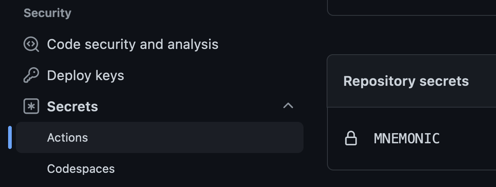

# [Solidity Template](#solidity-template)

[](https://github.com/mattstam/solidity-template/actions/workflows/unit-test.yaml)
[](https://github.com/mattstam/solidity-template/actions/workflows/integration-test.yaml)
[](https://github.com/mattstam/solidity-template/actions/workflows/slither.yaml)
[](https://github.com/mattstam/solidity-template/actions/workflows/lint.yaml)
[](https://www.npmjs.com/package/@mattstam/solidity-template/v/latest)

This is a modern Solidity template for Ethereum smart contracts. It combines two extremely powerful frameworks:

- [Foundry](#foundry) - for Unit tests written in Solidity ([contracts/test/](./contracts/test/)).
- [Hardhat](#hardhat) - for Integration tests written in Typescript ([integration/](./integration/)).

This template optimizes and cleans up using these frameworks together (e.g. no `remappings.txt` or `/lib` submodules, using one [foundry.toml](./foundry.toml) as a source of truth for options). Dependencies are all managed through [NPM](./package.json).

Utilizing both frameworks allows you to comprehensively test every scenario, which should always be the case when planning to deploy *immutable* code. Both layers of testing also gives other developers a reference for how they should interact with your contracts:

- On-chain developers writing contracts that call these contracts can refer to your [Unit Test files](./contracts/test/) to see the expected usage in [Solidity](https://docs.soliditylang.org/en/latest/).

- Off-chain developers writing clients that call these contracts can refer to your [Integration Test files](./integration/) to see the expected usage in [JavaScript (TypeScript)](https://www.typescriptlang.org/) and [Ethers.js](https://docs.ethers.io/v5/).

These frameworks also offer some advanced tools for contract debugging, deployment, gas measurements, etc.

Other features of this template are linting rules for [Solidity](./.solhint.json) and [TypeScript](./.eslintrc.js), a [developer guide](#developer-guide) for new contributors to your project, a [LICENSE](./LICENSE) sample which can be changed, a sample [CLI](./scripts/console) for contract deployment and interactions, [documentation generation](https://github.com/primitivefinance/primitive-dodoc) from NatSpec comments, and useful [GitHub Actions](#github-actions--workflow-badges) already configured.

&nbsp;

## [Template Usage](#template-usage)

Go to the top right of [this repository](https://github.com/mattstam/solidity-template) and click the big green ["Use this template"](https://github.com/mattstam/solidity-template/generate) button:

[](https://github.com/mattstam/solidity-template/generate)

Alternatively, you can set this template up through Foundry:

```sh
forge init --template https://github.com/mattstam/solidity-template <project-name>
```

This will create a copy of this repository for your project. A sample contract already exists, [Counter.sol](./contracts/Counter.sol), with its interface [ICounter.sol](./contracts/interfaces/ICounter.sol), Unit Test file [Counter.t.sol](./contracts/test/Counter.t.sol), and Integration Test file [counter.test.ts](./integration/counter.test.ts).


Use this as the foundation for how to write and test your contracts. Replace these with the contracts you want to build.

### [GitHub Actions & Workflow Badges](#github-actions--workflow-badges)

This repository comes with [GitHub Actions](https://github.com/features/actions) already configured. You can find them in the [./github/workflows](./.github/workflows/) directory. These will run the [Unit Tests](./.github/workflows/unit-test.yaml), [Integration Tests](./.github/workflows/integration-test.yaml), [Lint Check](./.github/workflows/lint.yaml), etc, during Pull Requests and merges to the master branch.

All that is required to get theses setup is to include your [`MNEMONIC`](https://metamask.zendesk.com/hc/en-us/articles/360015290032-How-to-reveal-your-Secret-Recovery-Phrase) environmental variable in the settings. In your GitHub repository, go to the `Settings` tab > `Security`/`Secrets`/`Actions` > click the big green "New repository secret" button:


The *Name* should be `MNEMONIC` and the *Secret* should be your [BIP-39](https://github.com/bitcoin/bips/blob/master/bip-0039.mediawiki) compatible phrase. Afterward you should see:



If you would like to also get badges for your workflows shown on this README, just uncomment out the lines at the top of this README:


### [Cleanup](#cleanup)

To make this specific to your project, just *Find And Replace* all the mentions of `mattstam/solidity-template`, `solidity-template`, and `Solidity Template` with the name of your project name.

Clear out everything in the [media](./media/) directory, as these images were just use in this README. Use this directory for your own project content instead.

Lastly, delete this [Template Usage](#template-usage) block in this README. You probably want to keep everything else, but customize it to your needs.

&nbsp;

## [Developer Guide](#developer-guide)

### [Directory Structure](#directory-structure)

```txt
integration/
|- counter.test.ts - "Integration tests with Hardhat"
scripts/
|- console.ts - "CLI for contracts"
|- deploy.ts - "Contract deployment functions"
contracts/
|- interfaces/
|--- ICounter.sol - "Interface contract"
|- test/
|--- Counter.t.sol - "Unit tests with Foundry"
|- Counter.sol - "Implementation contract"`
.env - "Real environment vars"
.env.example - "Example environment vars"
.eslintignore - "Ignore list for eslint"
.eslintrc - "Configure eslint"
.gitignore - "Ignore list for Git"
.solcover.js - "Configure coverage"
.solhint.json - "Configure Solidity linter"
.prettierignore - "Ignore list for Prettier"
.prettierrc.json - "Configure Prettier"
foundry.toml - "Configure Foundry"
hardhat.config.ts - "Configure Hardhat"
LICENSE - "Software license"
package.json - "Node dependencies"
slither.config.json - "Configure Slither"
tsconfig.json - "Configure Typescript"
```

--- *(not an extensive list of all files)* ---

&nbsp;

#### [Clone the repository](#clone-the-repository)

```sh
git clone https://github.com/mattstam/solidity-template.git && cd solidity-template
```

#### [Install Node.js / NPM](#install-nodejs--npm)

```sh
npm install -g npm
```

#### [Copy over a new `.env` file](#copy-over-a-new-env-file)

```sh
cp .env.example .env
```

Fill in *at least* your [`MNEMONIC`](https://metamask.zendesk.com/hc/en-us/articles/360015290032-How-to-reveal-your-Secret-Recovery-Phrase)

#### [Install Node dependencies](#install-node-dependencies)

```sh
npm i
```

#### [Install Foundry](#install-foundry)

```sh
curl -L https://foundry.paradigm.xyz | bash
```

Then, in a new terminal session or after reloading your `PATH`, run this to get
the latest [`forge`](https://book.getfoundry.sh/reference/forge/forge) and [`cast`](https://book.getfoundry.sh/reference/cast/cast) binaries:

```sh
foundryup
```

&nbsp;

## [Do Things](#do-things)

#### [Run the unit tests with Forge](#run-the-unit-tests-with-forge)

```sh
forge test
```

This will run everything in [contracts/test/](./contracts/test/), which utilizes [Forge](https://book.getfoundry.sh/forge/tests) to test contract code.

#### [Run the integration tests with Hardhat](#run-the-integration-tests-with-hardhat)

```sh
npm run test
```

This will run everything in [integration/](./integration/), which utilizes [Hardhat](https://hardhat.org/hardhat-runner/docs/getting-started#overview) to tests for full usage scenarios.

#### [Deploy to Goerli test network](#deploy-to-goerli-test-network)

Create a [.env](./.env) file matching the variables seen in [.env.example](./.env.example).

Getting fully prepared may involve getting a [`INFURA_API_KEY`](https://docs.infura.io/infura/getting-started) by signing up, and getting some test ETH on your target network via a [facet](https://goerlifaucet.com/).

Then run:

```sh
npm run deploy -- --network goerli
```

This will automatically update [deployments.json](./deployments.json), which gets exported with your [NPM package](./package.json). It will also become the default address to use when interacting with your contracts with the [CLI](./scripts/console).

#### [Generate documentation](#generate-documentation)

```sh
npm run doc
```

Sets up API docs from the [NatSpec](https://docs.soliditylang.org/en/latest/natspec-format.html) comments in your contract interfaces (ignoring implementations and libraries).

If desired, this can be updated to included all contract comments, and the path can be updated to a different location (such as if you want a seperate `docs` repository for your project).

&nbsp;

## [Foundry & Hardhat Info](#foundry--hardhat-info)

#### [Foundry](#foundry)

[Foundry](https://book.getfoundry.sh/) is a blazing fast, portable, and modular toolkit for Ethereum application development. It consists of:

- [Forge](https://book.getfoundry.sh/reference/forge/forge): Framework for [Unit / Fuzz testing](./contracts/test/) written in Solidity.
- [Cast](https://book.getfoundry.sh/reference/cast/cast): EVM interactions for contracts, transaction handling, and reading on-chain data.
- [Anvil](https://book.getfoundry.sh/reference/anvil/): A local testnet node with network forking capabilities.

Configuration details can be found in [foundry.toml](./foundry.toml).

#### [Hardhat](#hardhat)

[Hardhat](https://hardhat.org/getting-started/) is a complete Ethereum development environment. The [integration tests]((./integration/)) run on the [Hardhat network](https://hardhat.org/hardhat-network/), with each test written in [JavaScript (TypeScript)](https://www.typescriptlang.org/), utilizing the [Ethers.js](https://docs.ethers.io/v5/) library, and the [Mocha](https://mochajs.org/) testing framework.

Hardhat can also be extended (see the full [plugin list](https://hardhat.org/plugins/)). This project makes use of:

- [Hardhat Waffle](https://github.com/NomicFoundation/hardhat/blob/5659ee220069329df4354ba7cda446daaa24ab35/packages/hardhat-waffle/README.md) - test assertions with [Chai](https://ethereum-waffle.readthedocs.io/en/latest/matchers.html) matchers.
- [Hardhat Ethers](https://github.com/NomicFoundation/hardhat/blob/5659ee220069329df4354ba7cda446daaa24ab35/packages/hardhat-ethers/README.md) - integration with [Ethers.js](https://docs.ethers.io/v5/).
- [Hardhat Solhint](https://github.com/NomicFoundation/hardhat/blob/5659ee220069329df4354ba7cda446daaa24ab35/packages/hardhat-solhint/README.md) - integration with the Solidity language [Solhint linter](https://github.com/protofire/solhint).
- [Hardhat Gas Reporter](https://github.com/cgewecke/hardhat-gas-reporter) - gas cost summary of contract calls.
- [Hardhat Tracer](https://github.com/zemse/hardhat-tracer) - contract name tag for logs and advanced debugging.
- [Hardhat Contract Sizer](https://github.com/ItsNickBarry/hardhat-contract-sizer) - show output size of contracts.
- [Hardhat Etherscan](https://github.com/NomicFoundation/hardhat/blob/5659ee220069329df4354ba7cda446daaa24ab35/packages/hardhat-etherscan/README.md) - verify contract source code on [Etherscan](https://etherscan.io/).
- [Hardhat Dodoc](https://github.com/primitivefinance/primitive-dodoc) - documentation generation from [NatSpec](https://docs.soliditylang.org/en/latest/natspec-format.html).

Configuration details can be found in [hardhat.config.ts](./hardhat.config.ts), which inherits from [foundry.toml](./foundry.toml).

&nbsp;

## [Recommended VSCode Extensions](#recommended-vscode-extensions)

- [Solidity Visual Developer](https://marketplace.visualstudio.com/items?itemName=tintinweb.solidity-visual-auditor)
- [Solidity Language & Themes (only)](https://marketplace.visualstudio.com/items?itemName=tintinweb.vscode-solidity-language)
- [Solidity (by Hardhat authors)](https://marketplace.visualstudio.com/items?itemName=NomicFoundation.hardhat-solidity)
- [Solidity (by Juan Blanco)](https://marketplace.visualstudio.com/items?itemName=JuanBlanco.solidity)
- [Prettier](https://marketplace.visualstudio.com/items?itemName=SimonSiefke.prettier-vscode)

&nbsp;

## [Deployments](#deployments)

All contract addresses for each network are stored in [deployments.json](./deployments.json).

&nbsp;

## [License](#license)

The code in this project is licensed under the [MIT License](./LICENSE).
